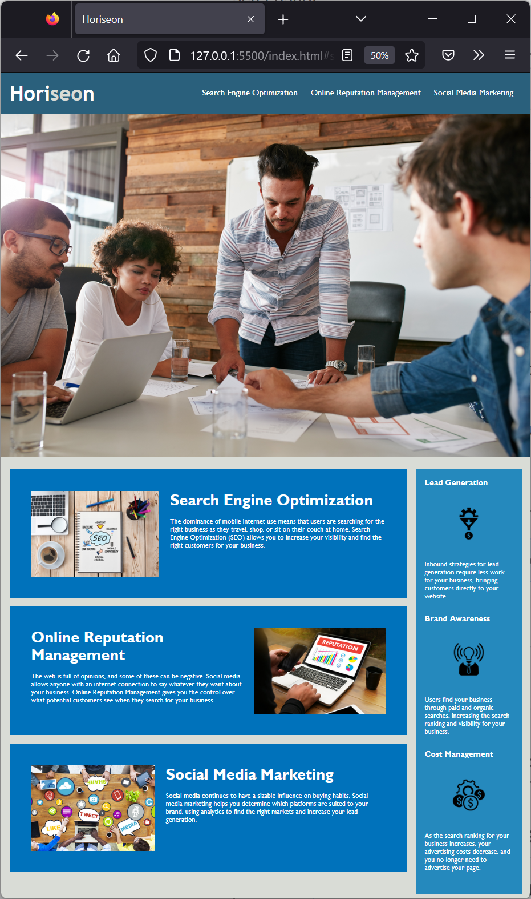

# bootcamp_week1_challenge

## Description

The propose of this challenge was to refactor HTML and CSS so that it meets accessibility standards. The following objectives should be achieved:

* Semantic HTML elements can be found throughout the source code
* HTML elements follow a logical structure independent of styling and positioning
* Image and icon elements contain accessible `alt` attributes
* Heading attributes fall in sequential order
* Title elements contain a concise, descriptive title

The resultant page should look like the following image

## Usage

The live page can be viewed here, [https://fezzer.github.io/bootcamp_week1_challenge/](https://fezzer.github.io/bootcamp_week1_challenge/)

This is a screenshot of the competed challenge

## License

Please refer to the license in this repo.